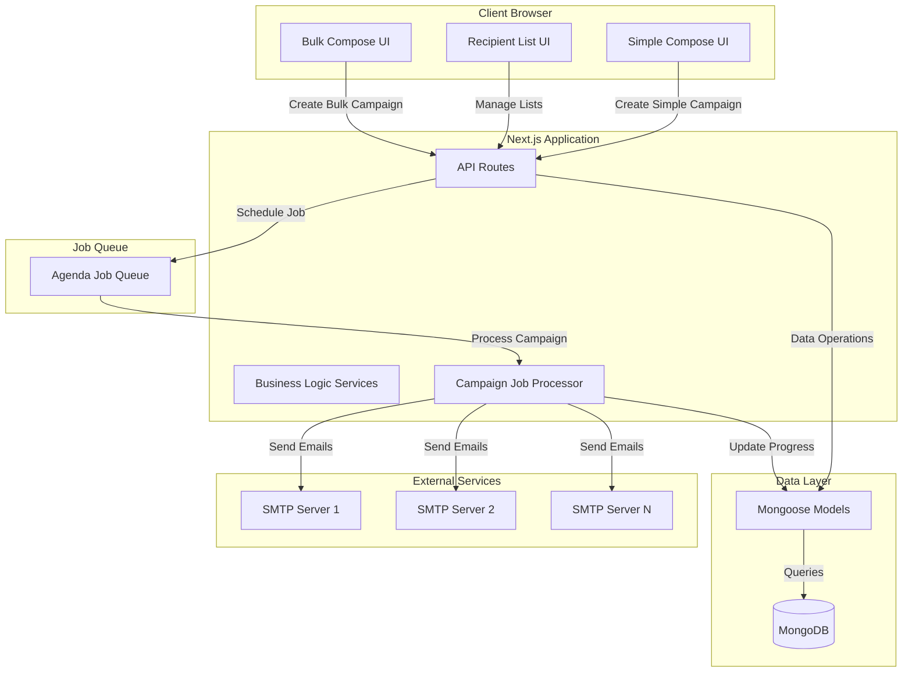
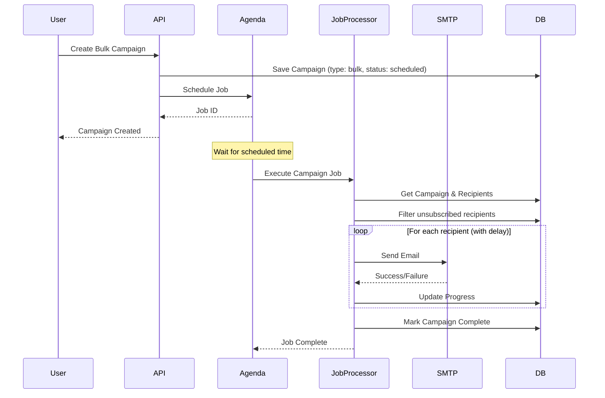

# Design Document

## Overview

The Advanced Bulk Email Campaign System extends the existing email tracking infrastructure to support large-scale email campaigns with recipient list management, multiple SMTP server configurations, advanced scheduling, and background job processing. The system uses Agenda for job queue management, maintains the existing Next.js/Mongoose architecture, and introduces new models for RecipientList, Recipient, and MailServerConfig while extending the Campaign model with a type discriminator.

The architecture follows the existing layered approach:
- **Presentation Layer**: React components with shadcn UI (new bulk compose UI)
- **API Layer**: Next.js API routes for recipient lists, mail servers, and bulk campaigns
- **Business Logic Layer**: Services for recipient management, bulk sending, and job scheduling
- **Data Layer**: New Mongoose models (RecipientList, Recipient, MailServerConfig) + extended Campaign model
- **Job Queue Layer**: Agenda for background campaign processing

## Architecture

### High-Level Architecture



### Campaign Processing Flow



## Components and Interfaces

### Frontend Components

#### Recipient List Management Page (`/dashboard/recipient-lists`)
- **Purpose**: Manage recipient lists
- **Components**:
  - `RecipientListTable`: Display all lists with counts
  - `CreateListButton`: Open create list dialog
  - `UploadRecipientsButton`: Upload CSV/Excel file
  - `ListActionsMenu`: Edit, delete, view recipients

#### Recipient List Detail Page (`/dashboard/recipient-lists/[id]`)
- **Purpose**: View and manage recipients in a list
- **Components**:
  - `RecipientTable`: Display all recipients with email, name, unsubscribe status
  - `AddRecipientForm`: Manually add recipient
  - `UploadRecipientsButton`: Upload more recipients
  - `RemoveRecipientButton`: Remove individual recipients
  - `ListStats`: Show total, active, unsubscribed counts

#### Mail Server Configuration Page (`/dashboard/mail-servers`)
- **Purpose**: Manage SMTP server configurations
- **Components**:
  - `MailServerTable`: Display all configured servers with status
  - `AddServerForm`: Add new SMTP configuration
  - `TestConnectionButton`: Validate SMTP settings
  - `ServerStatusBadge`: Show active/inactive/error status

#### Bulk Compose Page (`/dashboard/compose/bulk`)
- **Purpose**: Create bulk email campaigns
- **Components**:
  - `BulkEmailForm`: Form for email content and settings
  - `RecipientListSelector`: Multi-select dropdown for lists
  - `MailServerSelector`: Select servers with send limits
  - `ScheduleOptions`: Immediate, scheduled, recurring
  - `DelaySettings`: Set delay between sends
  - `TemplateVariableHelper`: Show available variables
  - `CampaignPreview`: Preview before sending

#### Campaign Monitor Page (`/dashboard/campaigns/[id]/monitor`)
- **Purpose**: Real-time campaign progress monitoring
- **Components**:
  - `ProgressBar`: Visual progress indicator
  - `CampaignStats`: Sent, remaining, failed counts
  - `SendingRate`: Emails per minute
  - `FailedRecipientsList`: Show failed sends with errors
  - `PauseResumeButtons`: Control campaign execution
  - `CancelButton`: Stop campaign

### API Routes

#### `/api/recipient-lists/create` (POST)
- **Purpose**: Create new recipient list
- **Authentication**: Required
- **Input**: `{ name: string, description?: string }`
- **Output**: `{ success: boolean, listId: string }`

#### `/api/recipient-lists/list` (GET)
- **Purpose**: List user's recipient lists
- **Authentication**: Required
- **Output**: `{ lists: RecipientList[] }`

#### `/api/recipient-lists/[id]` (GET)
- **Purpose**: Get list details with recipients
- **Authentication**: Required
- **Output**: `{ list: RecipientList, recipients: Recipient[], stats: { total, active, unsubscribed } }`

#### `/api/recipient-lists/[id]` (DELETE)
- **Purpose**: Delete recipient list and all recipients
- **Authentication**: Required
- **Output**: `{ success: boolean }`

#### `/api/recipients/add` (POST)
- **Purpose**: Add recipient to list
- **Authentication**: Required
- **Input**: `{ listId: string, email: string, name?: string, customFields?: object }`
- **Output**: `{ success: boolean, recipientId: string }`

#### `/api/recipients/upload` (POST)
- **Purpose**: Upload recipients from CSV/Excel
- **Authentication**: Required
- **Input**: FormData with file and listId
- **Output**: `{ success: boolean, added: number, skipped: number, errors: string[] }`

#### `/api/recipients/[id]` (DELETE)
- **Purpose**: Remove recipient from list
- **Authentication**: Required
- **Output**: `{ success: boolean }`

#### `/api/recipients/unsubscribe` (GET)
- **Purpose**: Unsubscribe recipient (public endpoint)
- **Authentication**: Not required
- **Query**: `recipientId`, `token` (for security)
- **Output**: HTML confirmation page

#### `/api/mail-servers/create` (POST)
- **Purpose**: Add mail server configuration
- **Authentication**: Required
- **Input**: `{ name: string, host: string, port: number, user: string, password: string, from: string }`
- **Output**: `{ success: boolean, serverId: string }`

#### `/api/mail-servers/list` (GET)
- **Purpose**: List user's mail servers
- **Authentication**: Required
- **Output**: `{ servers: MailServerConfig[] }`

#### `/api/mail-servers/test` (POST)
- **Purpose**: Test SMTP connection
- **Authentication**: Required
- **Input**: `{ serverId: string }`
- **Output**: `{ success: boolean, error?: string }`

#### `/api/mail-servers/[id]` (DELETE)
- **Purpose**: Delete mail server configuration
- **Authentication**: Required
- **Output**: `{ success: boolean }`

#### `/api/campaigns/bulk/create` (POST)
- **Purpose**: Create bulk email campaign
- **Authentication**: Required
- **Input**:
```typescript
{
  name: string,
  subject: string,
  htmlContent: string,
  recipientListIds: string[],
  mailServers: Array<{ serverId: string, limit: number }>,
  schedule: {
    type: 'immediate' | 'scheduled' | 'recurring',
    startDate?: Date,
    frequency?: 'daily' | 'weekly' | 'monthly',
    batchSize?: number,
    endDate?: Date
  },
  delay: number // seconds between sends
}
```
- **Output**: `{ success: boolean, campaignId: string, estimatedDuration: number }`

#### `/api/campaigns/[id]/pause` (POST)
- **Purpose**: Pause running campaign
- **Authentication**: Required
- **Output**: `{ success: boolean }`

#### `/api/campaigns/[id]/resume` (POST)
- **Purpose**: Resume paused campaign
- **Authentication**: Required
- **Output**: `{ success: boolean }`

#### `/api/campaigns/[id]/cancel` (POST)
- **Purpose**: Cancel campaign
- **Authentication**: Required
- **Output**: `{ success: boolean }`

#### `/api/campaigns/[id]/progress` (GET)
- **Purpose**: Get real-time campaign progress
- **Authentication**: Required
- **Output**: `{ status, sent, remaining, failed, rate, failedRecipients: [] }`

### Service Layer

#### RecipientListService
- `createList(userId, data)`: Create new recipient list
- `getListById(id, userId)`: Get list with authorization
- `listUserLists(userId)`: Get all user's lists
- `deleteList(id, userId)`: Delete list and recipients
- `getListStats(listId)`: Calculate total, active, unsubscribed counts

#### RecipientService
- `addRecipient(listId, data)`: Add single recipient
- `uploadRecipients(listId, file)`: Parse and import from file
- `parseCSV(file)`: Extract recipients from CSV
- `parseExcel(file)`: Extract recipients from Excel
- `validateEmail(email)`: Validate email format
- `checkDuplicate(listId, email)`: Check if email exists in list
- `removeRecipient(id, userId)`: Delete recipient
- `unsubscribeRecipient(id, token)`: Mark as unsubscribed
- `getActiveRecipients(listIds)`: Get non-unsubscribed recipients

#### MailServerService
- `createServer(userId, config)`: Add mail server configuration
- `testConnection(serverId)`: Validate SMTP settings
- `listUserServers(userId)`: Get all user's servers
- `deleteServer(id, userId)`: Remove server configuration
- `getServerById(id)`: Get server config
- `createSMTPTransport(config)`: Create nodemailer transport

#### BulkCampaignService
- `createBulkCampaign(userId, data)`: Create campaign and schedule job
- `validateCampaignData(data)`: Validate all inputs
- `calculateEstimatedDuration(recipientCount, delay)`: Estimate completion time
- `scheduleJob(campaign)`: Create Agenda job
- `pauseCampaign(campaignId)`: Pause execution
- `resumeCampaign(campaignId)`: Resume execution
- `cancelCampaign(campaignId)`: Stop and mark cancelled
- `getCampaignProgress(campaignId)`: Get current status

#### CampaignJobProcessor
- `processCampaign(job)`: Main job execution logic
- `getRecipients(campaign)`: Fetch all recipients from lists
- `filterUnsubscribed(recipients)`: Remove unsubscribed
- `distributeToServers(recipients, serverConfigs)`: Allocate recipients to servers
- `sendBatch(recipients, server, delay)`: Send emails with delay
- `processTemplate(html, recipientData)`: Replace template variables
- `updateProgress(campaignId, stats)`: Update campaign status
- `handleSendError(recipient, error)`: Log failed sends
- `checkPauseStatus(campaignId)`: Check if paused

#### TemplateService
- `processVariables(html, data)`: Replace {{variable}} with values
- `getAvailableVariables(recipientListIds)`: Get all custom fields
- `validateTemplate(html)`: Check for valid syntax

## Data Models

### RecipientList Model
```typescript
{
  _id: ObjectId,
  userId: ObjectId (ref: User),
  name: string,
  description?: string,
  createdAt: Date,
  updatedAt: Date
}
```

### Recipient Model
```typescript
{
  _id: ObjectId,
  recipientListId: ObjectId (ref: RecipientList),
  email: string,
  name?: string,
  customFields: Map<string, any>, // flexible custom data
  unsubscribed: boolean (default: false),
  unsubscribedAt?: Date,
  createdAt: Date,
  updatedAt: Date
}
```

### MailServerConfig Model
```typescript
{
  _id: ObjectId,
  userId: ObjectId (ref: User),
  name: string,
  host: string,
  port: number,
  secure: boolean,
  user: string,
  password: string (encrypted),
  from: string,
  status: 'active' | 'inactive' | 'error',
  lastTestedAt?: Date,
  createdAt: Date,
  updatedAt: Date
}
```

### Campaign Model (Extended)
```typescript
{
  _id: ObjectId,
  userId: ObjectId (ref: User),
  type: 'simple' | 'bulk', // NEW FIELD
  name?: string, // for bulk campaigns
  
  // Existing fields for simple campaigns
  to?: string,
  from?: string,
  subject: string,
  htmlContent: string,
  trackingId?: string,
  
  // New fields for bulk campaigns
  recipientListIds?: ObjectId[] (ref: RecipientList),
  mailServers?: Array<{
    serverId: ObjectId (ref: MailServerConfig),
    limit: number,
    sent: number
  }>,
  schedule?: {
    type: 'immediate' | 'scheduled' | 'recurring',
    startDate?: Date,
    frequency?: 'daily' | 'weekly' | 'monthly',
    batchSize?: number,
    endDate?: Date,
    lastExecutedAt?: Date
  },
  delay: number, // seconds
  
  // Progress tracking
  status: 'draft' | 'scheduled' | 'processing' | 'paused' | 'completed' | 'failed' | 'cancelled',
  totalRecipients: number,
  sentCount: number,
  failedCount: number,
  remainingCount: number,
  failedRecipients: Array<{
    email: string,
    error: string,
    timestamp: Date
  }>,
  
  // Job reference
  agendaJobId?: string,
  
  // Timestamps
  sentAt?: Date,
  completedAt?: Date,
  createdAt: Date,
  updatedAt: Date
}
```

### Indexes
- `RecipientList.userId`: Index for user filtering
- `Recipient.recipientListId`: Index for list queries
- `Recipient.email + recipientListId`: Compound unique index to prevent duplicates
- `Recipient.unsubscribed`: Index for filtering
- `MailServerConfig.userId`: Index for user filtering
- `Campaign.type`: Index for filtering by type
- `Campaign.userId + type`: Compound index for user's campaigns by type
- `Campaign.status`: Index for status filtering
- `Campaign.agendaJobId`: Index for job lookups

## Error Handling

### File Upload Errors
- Invalid file format: Return error with supported formats
- File too large: Limit to 10MB, return error if exceeded
- Parse errors: Skip invalid rows, return summary of errors
- Empty file: Return error if no valid recipients found

### SMTP Configuration Errors
- Connection failed: Display specific error (auth, network, etc.)
- Invalid credentials: Prompt user to check settings
- Server unreachable: Suggest checking firewall/network

### Campaign Execution Errors
- All servers failed: Pause campaign, notify user
- Server limit reached: Switch to next server automatically
- Recipient send failed: Log error, continue with next recipient
- Job processing error: Retry up to 3 times, then mark failed

### Unsubscribe Errors
- Invalid token: Display error page
- Recipient not found: Display error page
- Already unsubscribed: Display confirmation anyway

## Testing Strategy

### Unit Tests
- Test recipient file parsing (CSV, Excel)
- Test email validation logic
- Test template variable replacement
- Test server distribution algorithm
- Test progress calculation
- Test recurring schedule calculation

### Integration Tests
- Test recipient list CRUD operations
- Test mail server configuration and testing
- Test bulk campaign creation and scheduling
- Test Agenda job creation and execution
- Test pause/resume/cancel functionality
- Test unsubscribe flow

### End-to-End Tests
- Test complete bulk campaign flow (create → schedule → execute → complete)
- Test file upload and recipient import
- Test multi-server distribution
- Test recurring campaign execution
- Test campaign monitoring UI updates

### Performance Tests
- Test with large recipient lists (10,000+ recipients)
- Test concurrent campaign execution
- Test Agenda job queue performance
- Measure email sending throughput

## Security Considerations

### Authentication & Authorization
- All recipient list operations require authentication
- Users can only access their own lists and recipients
- Mail server passwords encrypted at rest
- Unsubscribe links use signed tokens to prevent tampering

### Input Validation
- Validate all file uploads (type, size, content)
- Sanitize email addresses and custom fields
- Validate SMTP configuration before saving
- Limit campaign size (max 50,000 recipients per campaign)

### Rate Limiting
- Limit file uploads (5 per minute per user)
- Limit campaign creation (10 per hour per user)
- Respect SMTP server rate limits
- Implement delay between sends to avoid spam flags

### Data Privacy
- Encrypt mail server passwords using crypto
- Hash unsubscribe tokens
- Allow users to export their recipient data
- Implement data retention policy (delete old campaigns after 1 year)

## Background Job Processing with Agenda

### Agenda Configuration
```typescript
{
  db: { address: MONGODB_URI, collection: 'agendaJobs' },
  processEvery: '10 seconds',
  maxConcurrency: 5,
  defaultConcurrency: 2,
  lockLimit: 10,
  defaultLockLimit: 5,
  defaultLockLifetime: 10 * 60 * 1000 // 10 minutes
}
```

### Job Definitions

#### `process-bulk-campaign`
- **Purpose**: Send emails for bulk campaign
- **Priority**: normal
- **Concurrency**: 2
- **Logic**:
  1. Load campaign and recipients
  2. Filter unsubscribed recipients
  3. Distribute recipients to mail servers
  4. Send emails with delay
  5. Update progress after each send
  6. Mark campaign complete

#### `process-recurring-campaign`
- **Purpose**: Execute recurring campaign batch
- **Priority**: normal
- **Concurrency**: 2
- **Logic**:
  1. Load campaign and check last execution
  2. Get next batch of recipients
  3. Send batch
  4. Update lastExecutedAt
  5. Schedule next execution

### Job Recovery
- On app startup, Agenda reconnects and resumes jobs
- Stale jobs (locked > 10 minutes) are automatically unlocked
- Failed jobs retry with exponential backoff (1min, 5min, 15min)
- After 3 failures, mark campaign as failed and notify user

## Performance Optimizations

### Database Optimizations
- Use indexes on all foreign keys
- Batch recipient queries (1000 at a time)
- Use lean() for read-only queries
- Cache mail server configs (5-minute TTL)

### Email Sending Optimizations
- Reuse SMTP connections (connection pooling)
- Send emails in parallel across multiple servers
- Implement exponential backoff for failed sends
- Use Agenda's concurrency to process multiple campaigns

### Frontend Optimizations
- Implement pagination for recipient lists (50 per page)
- Use React Query for data fetching and caching
- Implement virtual scrolling for large recipient lists
- Poll campaign progress every 5 seconds (not real-time WebSocket)

### File Upload Optimizations
- Stream file parsing (don't load entire file in memory)
- Process uploads in chunks (1000 recipients at a time)
- Use worker threads for large file parsing
- Validate file size before upload

## Deployment Considerations

### Environment Variables
```
# Existing variables
DATABASE_URL=mongodb://...
DATABASE_NAME=mail
BETTER_AUTH_SECRET=...
BETTER_AUTH_URL=https://yourdomain.com

# New variables for bulk campaigns
AGENDA_COLLECTION=agendaJobs
MAX_CAMPAIGN_SIZE=50000
MAX_FILE_SIZE_MB=10
UNSUBSCRIBE_SECRET=...
ENCRYPTION_KEY=... # for mail server passwords
```

### Agenda Setup
- Agenda uses the same MongoDB connection
- Jobs stored in separate collection (agendaJobs)
- Graceful shutdown: wait for jobs to complete (max 30 seconds)
- Monitor job queue length and processing time

### Scaling Considerations
- Agenda supports multiple app instances (distributed locking)
- Each instance can process jobs concurrently
- Use Redis for caching if needed
- Consider separate worker instances for job processing

### Monitoring
- Monitor Agenda job queue length
- Track campaign success/failure rates
- Alert on high failure rates
- Monitor SMTP server health
- Track email sending throughput

## Integration with Existing System

### Campaign Model Extension
- Add `type` field with default 'simple' for backward compatibility
- Existing simple campaigns continue to work unchanged
- Bulk campaigns use new fields (recipientListIds, mailServers, etc.)
- Campaign list UI filters by type

### Email Tracking Integration
- Bulk campaigns use existing tracking pixel and click tracking
- Each sent email gets a unique trackingId
- Open/click events linked to campaign via trackingId
- Analytics aggregate across all emails in bulk campaign

### UI Integration
- Add "Bulk Compose" button next to existing "Compose"
- Existing compose creates simple campaigns
- Bulk compose creates bulk campaigns
- Campaign list shows both types with type badge

### Backward Compatibility
- Existing Email model unchanged
- Existing tracking endpoints unchanged
- Existing analytics work for both campaign types
- Migration script to add type='simple' to existing campaigns
