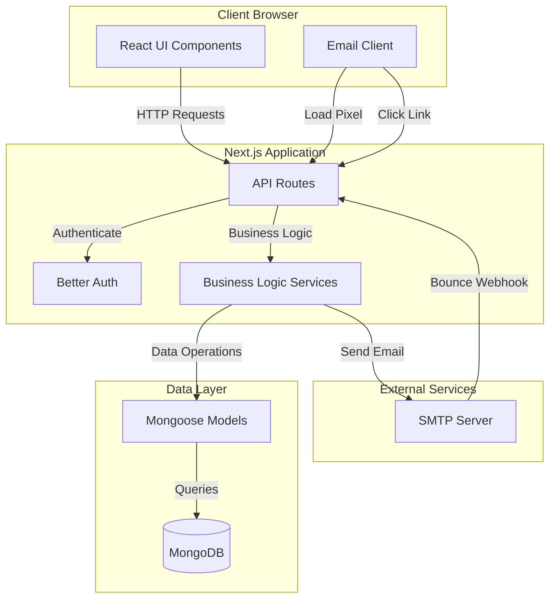

# Design Document

## Overview

The Email Tracking & Analytics System is a Next.js application that provides comprehensive email tracking capabilities similar to SendGrid or Mailgun. The system uses Next.js API routes for backend logic, Mongoose for MongoDB data persistence, Better Auth for authentication, and shadcn UI components for the frontend interface.

The architecture follows a layered approach:
- **Presentation Layer**: React components with shadcn UI
- **API Layer**: Next.js API routes handling HTTP requests
- **Business Logic Layer**: Service functions for email processing, tracking, and analytics
- **Data Layer**: Mongoose models and MongoDB for persistence
- **Integration Layer**: SMTP client for email delivery

## Architecture

### High-Level Architecture



### Data Flow

#### Email Sending Flow
1. User submits email form through UI
2. API route validates authentication and input
3. Service generates unique tracking ID
4. Service processes HTML content to inject tracking pixel and convert URLs
5. Service sends email via SMTP
6. Service stores email record in MongoDB
7. API returns success response with tracking ID

#### Open Tracking Flow
1. Email client loads tracking pixel image
2. API route receives GET request with tracking ID
3. Service logs open event with metadata (IP, user agent, timestamp)
4. Service updates email record with first open timestamp
5. API returns 1×1 transparent GIF

#### Click Tracking Flow
1. User clicks tracked link in email
2. API route receives GET request with tracking ID and destination URL
3. Service logs click event with metadata
4. Service updates email record with first click timestamp
5. API redirects user to original destination URL

#### Bounce Handling Flow
1. SMTP server sends bounce notification to webhook
2. API route receives POST request with bounce data
3. Service logs bounce event
4. Service updates email record with bounce status
5. API returns 200 OK

## Components and Interfaces

### Frontend Components

#### Dashboard Page (`/dashboard`)
- **Purpose**: Main analytics overview
- **Components**:
  - `StatsCards`: Display total sent, opens, clicks, bounces
  - `CampaignList`: List of campaigns with metrics
  - `RecentEmailsList`: Recent emails with status
  - `AnalyticsChart`: Timeline chart for opens/clicks

#### Email Composer Page (`/dashboard/compose`)
- **Purpose**: Create and send tracked emails
- **Components**:
  - `EmailComposerForm`: Form with recipient, subject, content, campaign selection
  - `CampaignSelector`: Dropdown to select or create campaign
  - `RichTextEditor`: HTML email content editor

#### Email Detail Page (`/dashboard/emails/[id]`)
- **Purpose**: View individual email tracking data
- **Components**:
  - `EmailMetadata`: Display email details
  - `OpenEventsList`: Table of all open events
  - `ClickEventsList`: Table of all click events
  - `BounceInfo`: Display bounce information if applicable

#### Campaign Detail Page (`/dashboard/campaigns/[id]`)
- **Purpose**: View campaign analytics
- **Components**:
  - `CampaignMetadata`: Display campaign details
  - `CampaignStats`: Aggregated metrics
  - `CampaignEmailsList`: List of emails in campaign
  - `CampaignChart`: Timeline chart for campaign

### API Routes

#### `/api/emails/send` (POST)
- **Purpose**: Send tracked email
- **Authentication**: Required
- **Input**: `{ to: string, subject: string, html: string, campaignId?: string }`
- **Output**: `{ success: boolean, trackingId: string, message: string }`
- **Logic**:
  1. Validate authentication
  2. Validate input fields
  3. Generate tracking ID
  4. Process HTML content
  5. Send email via SMTP
  6. Store email record
  7. Return response

#### `/api/emails/list` (GET)
- **Purpose**: List user's emails with pagination
- **Authentication**: Required
- **Query Params**: `page`, `limit`, `campaignId`
- **Output**: `{ emails: Email[], total: number, page: number }`

#### `/api/emails/[id]` (GET)
- **Purpose**: Get email details with events
- **Authentication**: Required
- **Output**: `{ email: Email, opens: OpenEvent[], clicks: ClickEvent[], bounce?: BounceEvent }`

#### `/api/track/open` (GET)
- **Purpose**: Track email opens
- **Authentication**: Not required
- **Query Params**: `id` (tracking ID)
- **Output**: 1×1 transparent GIF image
- **Logic**:
  1. Extract tracking ID from query
  2. Extract IP and user agent from headers
  3. Log open event asynchronously
  4. Return GIF immediately

#### `/api/track/click` (GET)
- **Purpose**: Track link clicks
- **Authentication**: Not required
- **Query Params**: `id` (tracking ID), `url` (destination)
- **Output**: HTTP 302 redirect
- **Logic**:
  1. Extract tracking ID and URL from query
  2. Extract IP and user agent from headers
  3. Log click event asynchronously
  4. Redirect to destination URL immediately

#### `/api/webhooks/bounce` (POST)
- **Purpose**: Handle bounce notifications
- **Authentication**: Webhook signature validation
- **Input**: `{ email: string, trackingId: string, reason: string, type: string }`
- **Output**: `{ success: boolean }`

#### `/api/campaigns/create` (POST)
- **Purpose**: Create new campaign
- **Authentication**: Required
- **Input**: `{ name: string, description?: string }`
- **Output**: `{ success: boolean, campaignId: string }`

#### `/api/campaigns/list` (GET)
- **Purpose**: List user's campaigns
- **Authentication**: Required
- **Output**: `{ campaigns: Campaign[] }`

#### `/api/campaigns/[id]` (GET)
- **Purpose**: Get campaign details with analytics
- **Authentication**: Required
- **Output**: `{ campaign: Campaign, stats: CampaignStats, emails: Email[] }`

#### `/api/analytics/dashboard` (GET)
- **Purpose**: Get dashboard analytics
- **Authentication**: Required
- **Output**: `{ totalSent, totalOpens, totalClicks, totalBounces, openRate, clickRate, ctr, bounceRate, timeline: [] }`

### Service Layer

#### EmailService
- `sendEmail(data)`: Process and send email with tracking
- `processHtmlContent(html, trackingId)`: Inject pixel and convert URLs
- `generateTrackingId()`: Create unique tracking identifier
- `getEmailById(id, userId)`: Retrieve email with authorization check
- `listEmails(userId, filters)`: List emails with pagination

#### TrackingService
- `logOpenEvent(trackingId, metadata)`: Record open event
- `logClickEvent(trackingId, url, metadata)`: Record click event
- `isGmailProxy(userAgent)`: Detect Gmail image proxy
- `updateEmailFirstOpen(trackingId, timestamp)`: Update email record
- `updateEmailFirstClick(trackingId, timestamp)`: Update email record

#### BounceService
- `logBounceEvent(data)`: Record bounce event
- `categorizeBounce(reason)`: Determine hard/soft bounce
- `flagEmailAddress(email)`: Mark email for review

#### CampaignService
- `createCampaign(userId, data)`: Create new campaign
- `getCampaignById(id, userId)`: Retrieve campaign with authorization
- `listCampaigns(userId)`: List user's campaigns
- `getCampaignStats(campaignId)`: Calculate aggregated metrics

#### AnalyticsService
- `getDashboardStats(userId)`: Calculate user's overall metrics
- `getEmailStats(emailId)`: Calculate email-level metrics
- `getCampaignStats(campaignId)`: Calculate campaign-level metrics
- `getTimeline(userId, dateRange)`: Get opens/clicks over time
- `calculateOpenRate(sent, uniqueOpens)`: Calculate percentage
- `calculateClickRate(uniqueOpens, uniqueClicks)`: Calculate percentage
- `calculateCTR(sent, uniqueClicks)`: Calculate percentage
- `calculateBounceRate(sent, bounces)`: Calculate percentage

## Data Models

### Email Model
```typescript
{
  _id: ObjectId,
  userId: ObjectId (ref: User),
  campaignId?: ObjectId (ref: Campaign),
  trackingId: string (unique, indexed),
  to: string,
  from: string,
  subject: string,
  htmlContent: string,
  sentAt: Date,
  firstOpenAt?: Date,
  firstClickAt?: Date,
  bounced: boolean,
  bounceReason?: string,
  bounceType?: 'hard' | 'soft',
  uniqueOpens: number,
  uniqueClicks: number,
  totalOpens: number,
  totalClicks: number,
  createdAt: Date,
  updatedAt: Date
}
```

### OpenEvent Model
```typescript
{
  _id: ObjectId,
  emailId: ObjectId (ref: Email),
  trackingId: string (indexed),
  ipAddress: string,
  userAgent: string,
  isGmailProxy: boolean,
  isUnique: boolean,
  timestamp: Date,
  createdAt: Date
}
```

### ClickEvent Model
```typescript
{
  _id: ObjectId,
  emailId: ObjectId (ref: Email),
  trackingId: string (indexed),
  destinationUrl: string,
  ipAddress: string,
  userAgent: string,
  isUnique: boolean,
  timestamp: Date,
  createdAt: Date
}
```

### BounceEvent Model
```typescript
{
  _id: ObjectId,
  emailId: ObjectId (ref: Email),
  trackingId: string (indexed),
  recipientEmail: string,
  bounceType: 'hard' | 'soft',
  reason: string,
  timestamp: Date,
  createdAt: Date
}
```

### Campaign Model
```typescript
{
  _id: ObjectId,
  userId: ObjectId (ref: User),
  name: string,
  description?: string,
  createdAt: Date,
  updatedAt: Date
}
```

### Indexes
- `Email.trackingId`: Unique index for fast lookup
- `Email.userId`: Index for user filtering
- `Email.campaignId`: Index for campaign filtering
- `OpenEvent.trackingId`: Index for event queries
- `OpenEvent.emailId`: Index for email detail queries
- `ClickEvent.trackingId`: Index for event queries
- `ClickEvent.emailId`: Index for email detail queries
- `BounceEvent.trackingId`: Index for event queries
- `Campaign.userId`: Index for user filtering

## Error Handling

### API Error Responses
All API routes return consistent error format:
```typescript
{
  success: false,
  error: string,
  code: string
}
```

### Error Codes
- `AUTH_REQUIRED`: User not authenticated
- `INVALID_INPUT`: Validation failed
- `NOT_FOUND`: Resource not found
- `UNAUTHORIZED`: User lacks permission
- `SMTP_ERROR`: Email sending failed
- `DATABASE_ERROR`: Database operation failed
- `RATE_LIMIT`: Too many requests

### Error Handling Strategy

#### Client-Side Errors
- Display user-friendly error messages using toast notifications (sonner)
- Provide actionable feedback (e.g., "Please check the email address format")
- Log errors to console for debugging

#### Server-Side Errors
- Log all errors with context (user ID, request details)
- Return appropriate HTTP status codes
- Never expose sensitive information in error messages
- For tracking endpoints, always return success response even on error to avoid breaking email experience

#### SMTP Errors
- Retry failed sends up to 3 times with exponential backoff
- Log SMTP errors with full details
- Mark email as failed in database
- Notify user of send failure

#### Database Errors
- Implement connection retry logic
- Use transactions for multi-document operations
- Log database errors with query details
- Return generic error message to client

## Testing Strategy

### Unit Tests
- Test service functions in isolation
- Mock database operations
- Test analytics calculations
- Test HTML content processing
- Test tracking ID generation

### Integration Tests
- Test API routes end-to-end
- Test authentication flow
- Test email sending with mock SMTP
- Test tracking pixel and click redirect
- Test webhook handling

### End-to-End Tests
- Test complete user flows (compose → send → track → view analytics)
- Test dashboard rendering with real data
- Test campaign creation and management
- Test email detail page with events

### Performance Tests
- Load test tracking endpoints (target: 1000 req/s)
- Test database query performance with large datasets
- Test analytics calculation performance
- Measure API response times

### Test Data
- Create seed data for development
- Use factories for test data generation
- Test with various email HTML structures
- Test with different user agents (Gmail proxy, mobile, desktop)

## Security Considerations

### Authentication
- All dashboard routes require authentication via Better Auth
- Tracking endpoints are public but use unique, unguessable tracking IDs
- Webhook endpoints validate signature from SMTP provider

### Authorization
- Users can only access their own emails and campaigns
- All database queries filter by userId
- Email detail pages verify ownership before displaying

### Data Privacy
- Store minimal personal data (IP addresses hashed)
- Implement data retention policy (delete events after 90 days)
- Provide user data export functionality
- Allow users to delete their data

### Input Validation
- Validate all user inputs on server-side
- Sanitize HTML content to prevent XSS
- Validate email addresses using regex
- Limit email content size (max 1MB)

### Rate Limiting
- Implement rate limiting on send endpoint (10 emails/minute per user)
- Rate limit tracking endpoints to prevent abuse (1000 req/minute per IP)
- Rate limit API endpoints (100 req/minute per user)

### SMTP Security
- Use TLS for SMTP connections
- Store SMTP credentials in environment variables
- Validate sender domain to prevent spoofing
- Implement SPF, DKIM, DMARC for sent emails

## Performance Optimizations

### Database Optimizations
- Use indexes on frequently queried fields
- Implement pagination for list endpoints
- Use aggregation pipelines for analytics calculations
- Cache campaign stats (5-minute TTL)

### Tracking Endpoint Optimizations
- Return response immediately, log events asynchronously
- Use minimal database writes (batch if possible)
- Set appropriate cache headers on tracking pixel
- Use CDN for tracking pixel if high traffic

### Frontend Optimizations
- Implement infinite scroll for email lists
- Use React Query for data fetching and caching
- Lazy load charts and heavy components
- Optimize bundle size with code splitting

### SMTP Optimizations
- Use connection pooling for SMTP
- Queue emails for batch sending
- Implement retry logic with exponential backoff
- Monitor SMTP rate limits

## Deployment Considerations

### Environment Variables
```
DATABASE_URL=mongodb://...
DATABASE_NAME=mail
BETTER_AUTH_SECRET=...
BETTER_AUTH_URL=https://yourdomain.com
CORS_ORIGIN=https://yourdomain.com
SMTP_HOST=smtp.yourdomain.com
SMTP_PORT=587
SMTP_USER=noreply@yourdomain.com
SMTP_PASSWORD=...
SMTP_FROM=YourApp <noreply@yourdomain.com>
WEBHOOK_SECRET=...
```

### Infrastructure
- Deploy Next.js app to Vercel or similar platform
- Use MongoDB Atlas for database
- Use SendGrid, Mailgun, or Amazon SES for SMTP
- Use Redis for caching (optional)

### Monitoring
- Monitor API response times
- Track email send success rate
- Monitor tracking endpoint traffic
- Alert on high bounce rates
- Track database performance

### Scaling Considerations
- Tracking endpoints can scale horizontally
- Database reads can use read replicas
- Implement queue for email sending (Bull, BullMQ)
- Use CDN for static assets and tracking pixel
